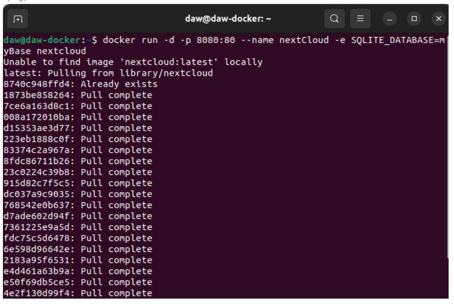

# Docker

> Carlota Menéndez Álvarez    2º Evaluación Despliegue

[TOC]

## Ejercicios de Repaso

#### Ejercicio 1


Instala Docker en una máquina y configúralo para que se pueda usar con un usuario sin privilegios.

La máquina virtual inicialmente ya disponia de Docker. En el caso de no tener Docker instalado sería:

```sh 
apt install docker.io
```

Y el comando para utilizar Docker sin privilegios:

```sh
usermod -aG docker user
```


#### Ejercicio 2

Ejecuta un contenedor a partir de la imagen `hello-word`. Comprueba que nos devuelve la salida adecuada. Comprueba que no se está ejecutando. Lista los contenedores que están parado. Borra el contenedor.

Ejecuto el contenedor:


Compruebo que no se esta ejecutando:


Listo los contenedores que están parado:


Borrar contenedor:

`docker rm mi_prueba`


#### Ejercicio 3

 Crea un contenedor interactivo desde una imagen debian. Instala un paquete (por ejemplo `nano`). Sal de la terminal, ¿sigue el contenedor corriendo? ¿Por qué?. Vuelve a iniciar el contenedor y accede de nuevo a él de forma interactiva. ¿Sigue instalado el `nano`?. Sal del contenedor, y bórralo. Crea un nuevo contenedor interactivo desde la misma imagen. ¿Tiene el `nano` instalado?


a) Creación del contenedor Interactivo:


b) Instalación de un paquete

Para realizar la instalación de un paquete como nano, será necesario hacer un `apt update` y una vez hecho esto, nos dejará instalar el paquete con el comando:

`apt install nano`


c) Sal de la terminal, ¿sigue el contenedor corriendo? ¿Por qué?.


No sigue corriendo el contenedor, porque se cerró y no está en segundo plano


d) Vuelve a iniciar el contenedor y accede de nuevo a él de forma interactiva. ¿Sigue instalado el `nano`?

Utilizo el comando `docker start -i debian1` , para iniciar el contenedor


Como se ve en la imagen anterior, sigue estando instalado el paquete nano.


e) Sal del contenedor, y bórralo. Crea un nuevo contenedor interactivo desde la misma imagen. ¿Tiene el `nano` instalado?


No tiene instalado el paquete nano.

#### Ejercicio 4

Crea un contenedor demonio con un servidor nginx, usando la imagen oficial de nginx. Al crear el contenedor, ¿has tenido que indicar algún comando para que lo ejecute? Accede al navegador web y comprueba que el servidor esta funcionando. Muestra los logs del contenedor.


Es importante saber que para correr un contenedor en segundo plano osea demonio, debe tener **-d**  a continuación de run.


Comprobación:


Con el comando `docker logs nginx1` podré ver los logs de ese contenedor


#### Ejercicio 5

Crea un contenedor con la aplicación Nextcloud, mirando la documentación en docker Hub,para personalizar el nombre de la base de datos sqlite que va a utilizar.

El comando a utilizar será: 

```sh
docker run -d -p 8080:80 --name nextCloud -e SQLITE_DATABASE=myBase nextcloud
```



### Referencias

https://hub.docker.com/_/nextcloud

https://www.digitalocean.com/community/tutorials