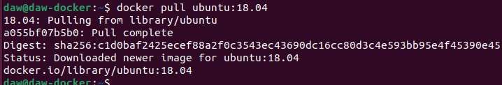
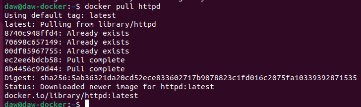
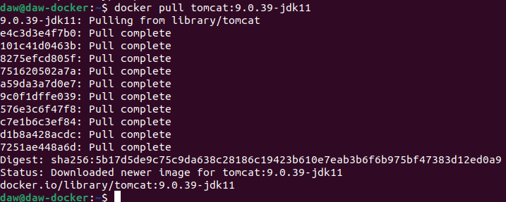
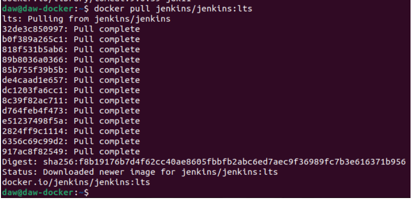
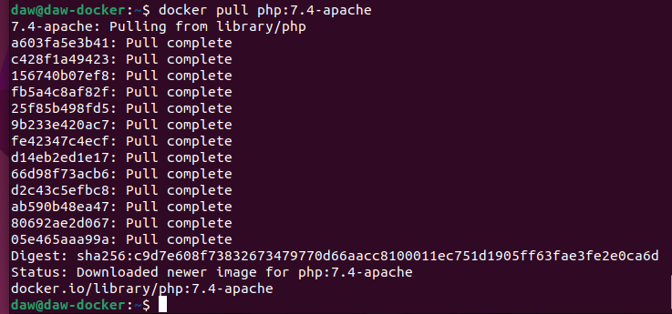
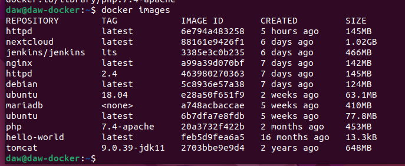
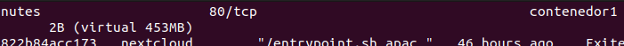
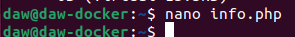
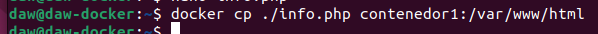
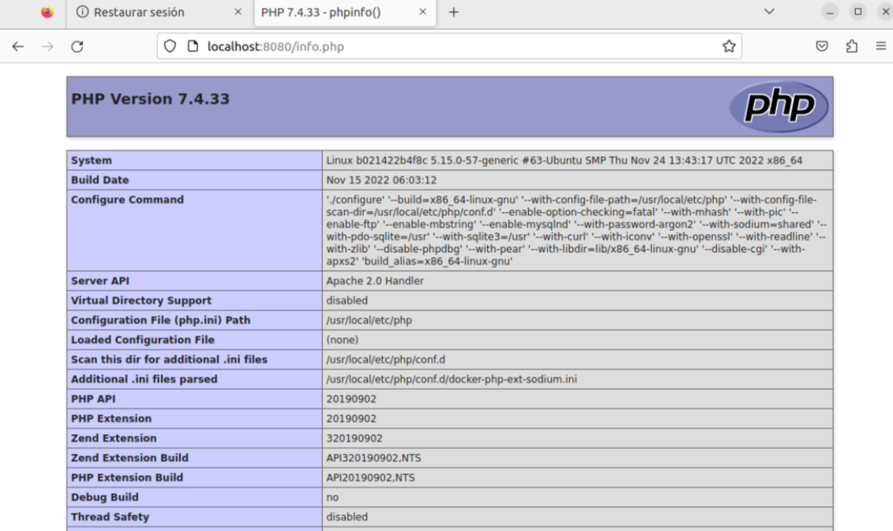

# Docker Imágenes

> Carlota Menéndez Álvarez


## Ejercicio 1

Descarga las siguientes imágenes: `ubuntu 18.04`, `httpd`,` tomcat 9.0.39-jdk11` ,` jenkins/jenkins:lts, php 7.4-apache`

Comando: 

```sh
docker pull ubuntu:tag
```


Ubuntu:




Apache:



Tomcat:



Jenkins:



Php:




## Ejercicio 2

Muestra todas las imágenes que tienes descargadas:




## Ejercicio 3

Crea un contenedor demonio con la imagen php:7.4-apache

Comando: 

```sh
docker run -d --name contenedor1 php:7.4-apache
```


## Ejercicio 4

Comprueba el tamaño del contenedor en el disco duro

```sh
docker ps -a -s
```





## Ejercicio 5

Con la instrucción `docker cp` podemos copiar ficheros desde un contenedor. Crea un fichero en tu ordenador con el siguiente contenido:

```sh
<?php
	echo phpinfo();
?>
```

Copia un fichero `info.php` al directorio `var/www/html`del contenedor con docker cp.


Primero creo el documento:



A continuación copio ese fichero al contenedor dentro de la ruta especificada anteriormente:



## Ejercicio 6

Vuelve a comprobar el espacio ocupado por el contenedor


Ha aumentado.


## Ejercicio 7




