# Almacenamiento Docker

> Carlota Menéndez Álvarez   Despliegue 2º Evaluación

[TOC]

## Volúmenes docker

 ### Ejercicio 1

Crea un volumen docker que se llame miweb.

 `docker volume create miweb`

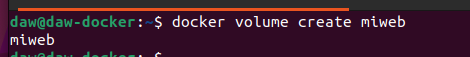

### Ejercicio 2

Crea un contenedor desde la imagen php:7.4-apache donde montes en el directorio/var/www/html (que sabemos que es el DocumentRoot del servidor que nos ofrece esaimagen) el volumen docker que has creado.

 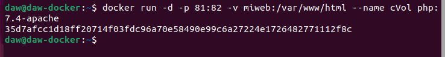

Este volumen que he creado tendrá el siguiente directorio:

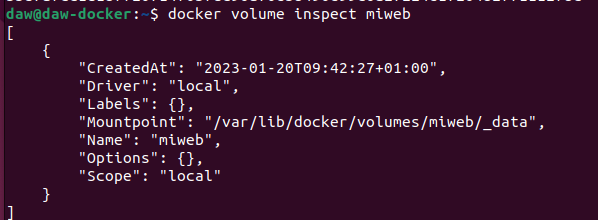

### Ejercicio 3

Utiliza el comando docker cp para copiar un fichero index.html en el directorio/var/www/html.

 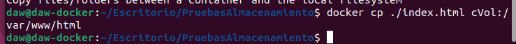

### Ejercicio 4

Accede al contenedor desde el navegador para ver la información ofrecida por el ficheroindex.html.

Con el comando `docker inspect cVol` cojo la Ip de ese contenedor y desde el navegador accedo en esa ruta al index copiado.

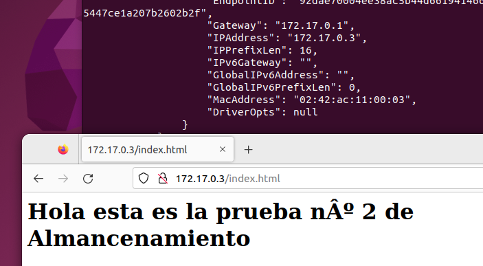

 

### Ejercicio 5

Borra el contenedor

 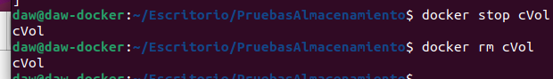

### Ejercicio 6

Crea un nuevo contenedor y monta el mismo volumen como en el ejercicio anterior.

 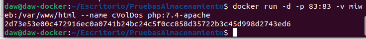

### Ejercicio 7

Accede al contenedor desde el navegador para ver la información ofrecida por el ficheroindex.html. ¿Seguía existiendo ese fichero?

 La información sigue existiendo por que es persistente:

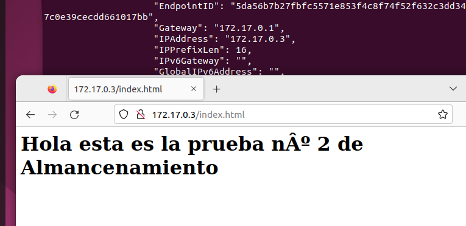

## Bind Mount

### Ejercicio 1

Crea un directorio en tu host y dentro crea un fichero index.html.

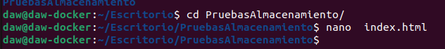

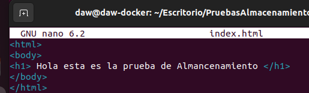

### Ejercicio 2

Crea un contenedor desde la imagen php:7.4-apache donde montes en el directorio/var/www/html el directorio que has creado por medio de bind mount.

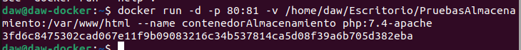

### Ejercicio 3

Accede al contenedor desde el navegador para ver la información ofrecida por el ficheroindex.html.

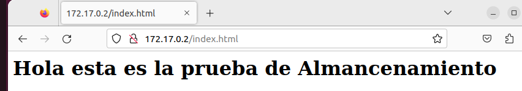

### Ejercicio 4

Modifica el contenido del fichero index.html en tu host y comprueba que al refrescar la página ofrecida por el contenedor, el contenido ha cambiado.

Realizo los cambios:

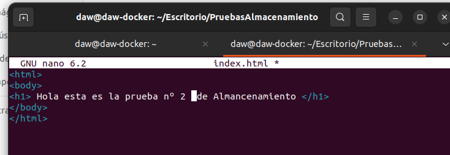

Compruebo que han cambiado:

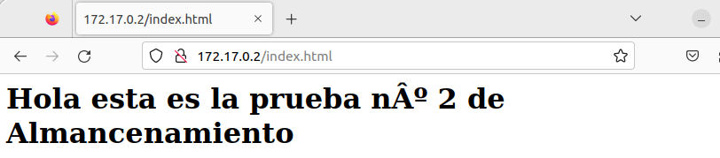

### Ejercicio 5 

Borra el contenedor

Primero hay que parar el contenedor, para luego borrarlo

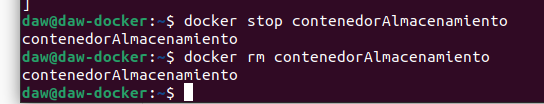

### Ejercicio 6

Crea un nuevo contenedor y monta el mismo directorio como en el ejercicio anterior.

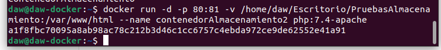

### Ejercicio 7

Accede al contenedor desde el navegador para ver la información ofrecida por el ficheroindex.html. ¿Se sigue viendo el mismo contenido?

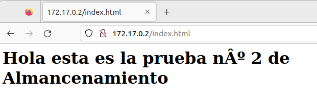

Sigue viéndose el mismo contenido.