# Redes Docker


> Carlota Menéndez Álvarez


[TOC]


## Trabajar con redes Docker

### Ejercicio 1

Vamos a crear dos redes de ese tipo (BRIDGE) con los siguientes datos:
**Red1**
Nombre: red1
Dirección de red: 172.28.0.0
Máscara de red: 255.255.0.0
Gateway: 172.28.0.1
**Red2**
Nombre: red2
Es resto de los datos será proporcionados automáticamente por Docker.


*Creación de red1*

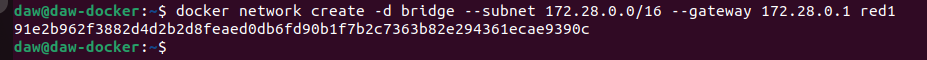

*Creación de red2*

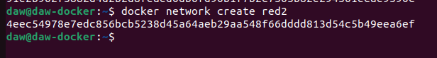


### Ejercicio 2

 Poner en ejecución un contenedor de la imagen ubuntu:20.04 que tenga como hostname
host1 , como IP 172.28.0.10 y que esté conectado a la red1. Lo llamaremos u1 .


Comando: 

```sh
docker run -it --name contenedor1 --network red1 --ip 172.28.0.10 --hostname host1 ubuntu:20.04
```


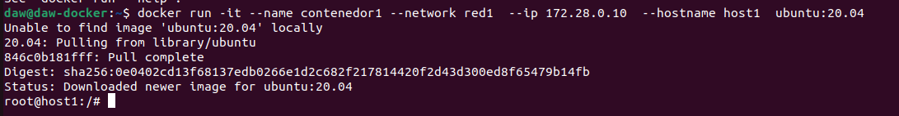

*Comprobaciones*

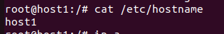


### Ejercicio 3

Entrar en ese contenedor e instalar la aplicación ping ( apt update && apt install
inetutils-ping ).

*Instalación*

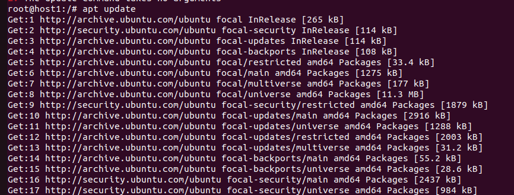


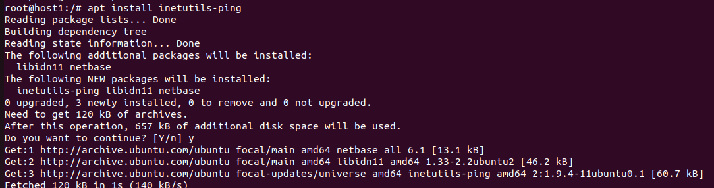


### Ejercicio 4

Poner en ejecución un contenedor de la imagen ubuntu:20.04 que tenga como hostname
host2 y que esté conectado a la red2. En este caso será docker el que le de una IP correspondiente
a esa red. Lo llamaremos u2 .

```sh
docker run -it --name u2 --network red2 --hostname host2 ubuntu:20.04
```


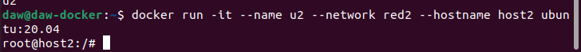

*Comprobación*

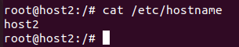


### Ejercicio 5

 Entrar en ese contenedor e instalar la aplicación ping ( apt update && apt install
inetutils-ping ).

*Instalación:*

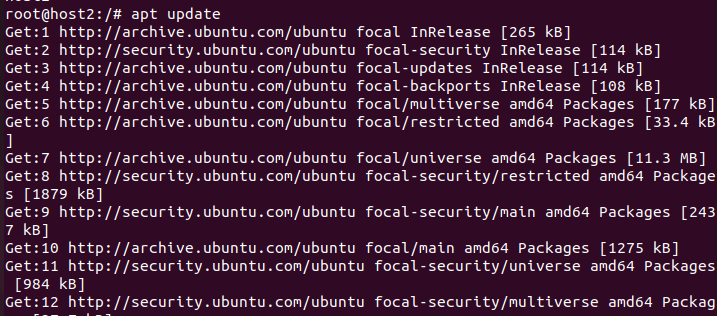

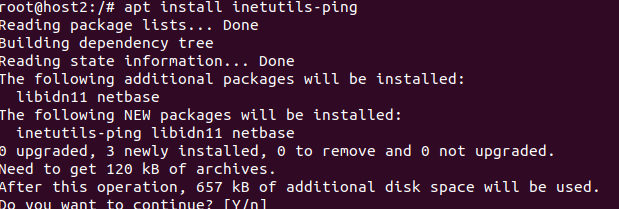


**Comprobaciones**


Contenedor 1:

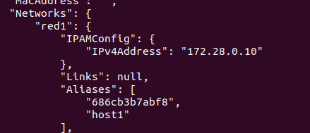

Contenedor 2:

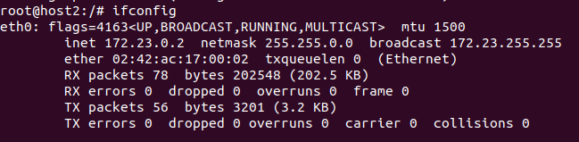


Ping entre contenedores:

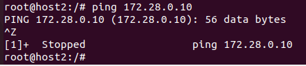

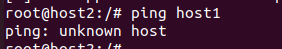


Cambio la red del contenedor1:


Ahora mismo estan en la misma red los dos contenedores,  y hago ping :

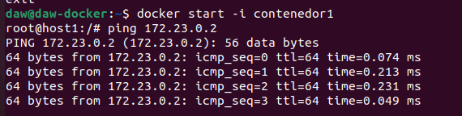

Se ven, pruebo haciendo Ping con el nombre del host

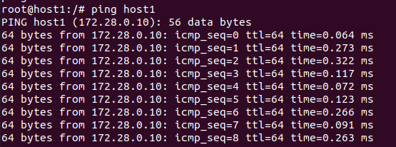


## Despliegue de Nextcloud + mariadb

### Ejercicio 1

Crea una red de tipo bridge.

```sh
docker network create redNueva
```


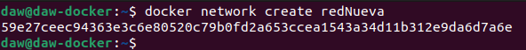

### Ejercicio 2

Crea el contenedor de la base de datos conectado a la ed que has creado. La base de datos se debe
configurar para crear una base de dato y un usuario. Además el contenedor debe utilizar
almacenamiento (volúmenes o bind mount) para guardar la información. Puedes seguir la
documentación de mariadb o la de PostgreSQL .

```shell
docker run -d --name contenedorMaria --network redNueva -v /opt/mysql_base1:/var/lib/mysql -e MYSQL_DATEBASE=b1 -e MYSQL_USER=usu1 -e MYSQL_PASSWORD=123456 -e MYSQL_ROOT_PASSWORD=123456  mariadb:10.5
```


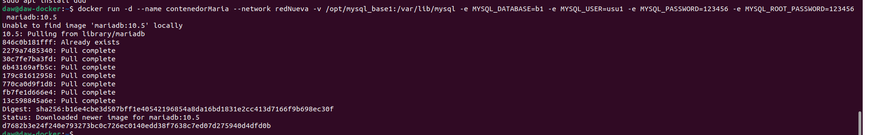


### Ejercicio 3

A continuación, siguiendo la documentación de la imagen nextcloud , crea un contenedor conectado a
la misma red, e indica las variables adecuadas para que se configure de forma adecuada y realice la
conexión a la base de datos. El contenedor también debe ser persistente usando almacenamiento.

```sh
docker run -d -p 8081:80 --name contenedorMaria2 --network redNueva --link contenedorMaria -v nextcloud:/var/www/html nextcloud
```


### Ejercicio 4

Accede a la aplicación usando un navegador web.

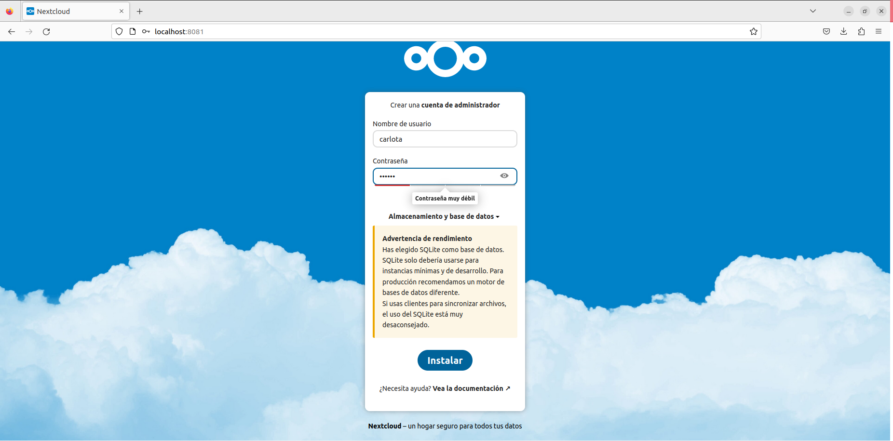

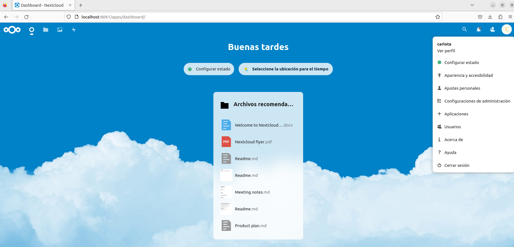


A tener en cuenta:

Id de todos los contenedores q tenga `docker ps -a -q`

`docker rm -f $(docker ps -a -q)` - Borra todos los contenedores existentes.

`docker start -i contenedor`

